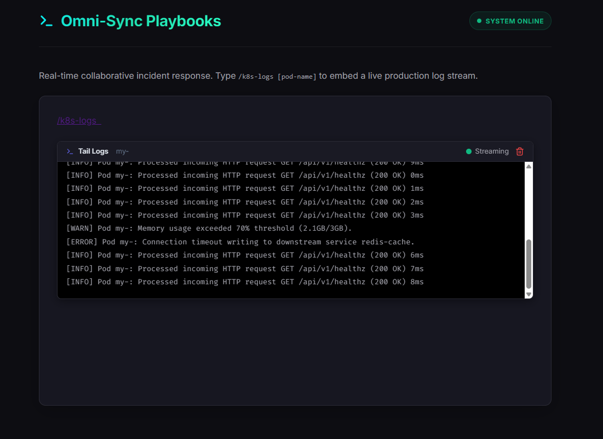
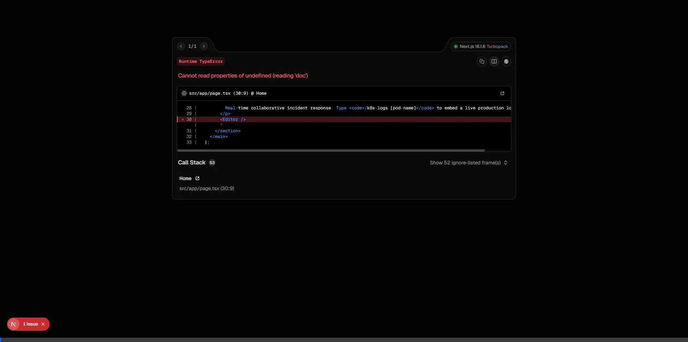

# Omni-Sync



Omni-Sync is a high-performance, real-time collaborative markdown editor designed specifically for SRE Incident Playbooks. It combines a highly reliable Go backend using CRDTs (Yjs) with a "Super Frontend" built in Next.js 15.

### 🎥 Live Demonstration



## System Overview

The system consists of three main components:
1. **Frontend (Super Frontend)**: A Next.js 15 application featuring the Tiptap/ProseMirror editor suite. It connects to the backend over WebSockets utilizing the `y-websocket` protocol, enabling collaborative text editing with floating presence cursors and an embedded streamable log window for real-time SRE incident response.
2. **Backend (Sync Engine)**: A Go-based WebSocket signaling server. It brokers the Yjs binary updates between clients and manages presence packets (awareness) to indicate live user cursors.
3. **Storage (Persistence)**: A Redis instance backing the Go server, storing the binary CRDT state of documents to prevent data loss across server restarts or crashes.

## Key Features Built for SRE

- **Binary Persistence Engine**: Omni-Sync deeply integrates with the `y-websocket` CRDT synchronization stream. By precisely decoding Yjs binary payloads directly inside Go, it efficiently persists actual document state mutations (SyncStep2 & Update) into a durable Redis append-only log without the overhead of tracking ephemeral sync handshakes. Data guarantees zero-loss across sessions.
- **Interactive SRE Nodes & Live Charts**: The editor natively supports interactive components (React inside Tiptap). The **K8sStatusBlock** displays simulated pod latency overlaid on a live Recharts sparkline, offering immediate, shared visibility into cluster degradation. 
- **Command Palette (`Cmd+K`)**: Pressing `Cmd+K` brings up an animated, keyboard-friendly command palette powered by `cmdk` and `shadcn/ui`. Seamlessly insert K8s Status blocks or trigger state snapshots anywhere in the playbook.
- **Presence & High-Performance Rendering**: The "Awareness" protocol is fully active to display your teammates' multi-colored cursors and name badges moving around the document in real time. Cursor tracking and the React lifecycle are optimized via `React.memo` and movement throttling, neutralizing unnecessary DOM reconciliation cycles. 

## Local Setup

### Prerequisites
- Node.js (v18+)
- Go (v1.21+)
- Docker (for Redis, optional if you have local Redis)

### 1. Start Redis
If using Docker, run a Redis container:
```bash
docker run -d -p 6379:6379 --name redis-omni redis
```
*(If you already have Redis installed locally, just ensure it's running on port 6379).*

### 2. Start the Go Backend
The Go backend runs the WebSocket signaling server on port 8080.
```bash
cd backend
go mod tidy
go run main.go
```

### 3. Start the Next.js Frontend
The frontend runs on port 3000.
```bash
cd frontend
npm install
npm run dev
```

### 4. Open the Editor
Navigate to [http://localhost:3000](http://localhost:3000). To test collaboration, open the URL in multiple browser windows side-by-side.

## Additional Commands
- **SRE Power Command**: Type `/k8s-logs [pod-name]` anywhere in the document to render an inline, streaming log window that continuously fetches mock Kubernetes logs from the server. Alternately, use the `Cmd+K` Command Palette to insert it.
