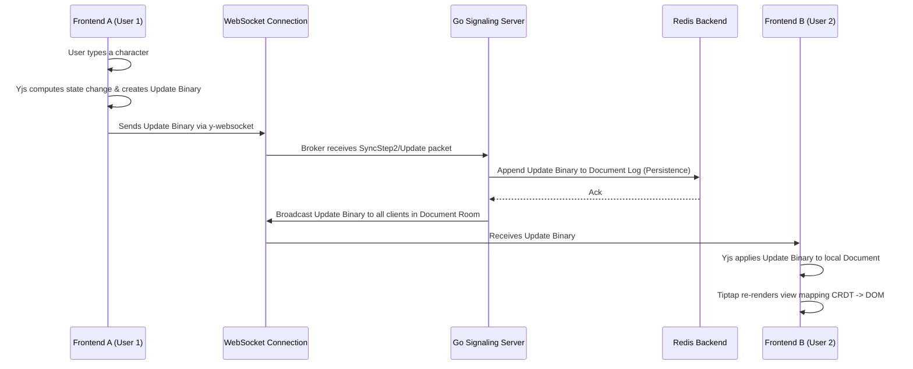

# Learning and Architecture (Mentor Document)

Welcome to Omni-Sync. This document serves as a guide for understanding the "hows" and "whys" of our real-time collaborative architecture, designed for reliability and high performance.

## How it Works: Real-Time Data Flow

Below is a sequence diagram detailing the journey of a single keystroke from one user's frontend to another user's display, navigating through our CRDT network.

## Architectural Decision Records (ADRs)

### ADR 1: Choosing Yjs over Automerge
**Context:** We required a highly optimized CRDT (Conflict-free Replicated Data Type) engine to power real-time collaborative text editing.
**Decision:** We chose **Yjs**.
**Rationale:** 
1. **Performance**: Yjs represents state updates with a highly optimized binary format, producing significantly smaller network payloads and faster synchronization times compared to Automerge.
2. **Ecosystem**: Yjs has excellent, first-class bindings for ProseMirror and Tiptap (`y-prosemirror`), matching our Next.js frontend tech stack perfectly.
3. **Awareness**: Yjs has a built-in "Awareness" protocol specifically designed for volatile cursor and selection data, separate from the persisted document state.

### ADR 2: Go and Redis for Signaling and Persistence
**Context:** We needed a robust signaling server to broker Yjs WebSocket connections and ensure document state isn't lost during deployments or server crashes.
**Decision:** Implement the backend in **Go**, utilizing **Redis** as an append-only transaction log.
**Rationale:**
1. **Concurrency:** Go's goroutines and channels make it uniquely suited to handling thousands of concurrent WebSocket connections efficiently.
2. **Simplicity over Node.js:** While a Node/Hocuspocus backend is common for Yjs, a custom Go server provides greater control over memory allocation and binary packet routing.
3. **Redis Persistence:** Redis is extremely fast. Appending Yjs binary updates to a Redis list acts as an immutable, real-time log. If the Go server restarts, it simply fetches the log from Redis, reconstructs the CRDT state, and resumes serving clients without missing a beat.

## Common Pitfalls in Real-Time CRDT Apps

Building real-time collaborative applications introduces specialized challenges. Here are the top 3 and how Omni-Sync prevents them:

### 1. Memory Bloat (The History Sink)
**The Pitfall:** CRDTs theoretically store every character ever typed and deleted to resolve conflicts perfectly, meaning document size grows indefinitely. Over time, loading a heavy document crashes browser tabs.
**Our Solution:** We implement "Garbage Collection" inherent to Yjs. Once all connected peers have synced up to the latest state vector, deleted characters (tombstones) are pruned. The state stored in Redis is also periodically squashed/compacted into a single snapshot rather than an endless log of diffs.

### 2. The "Ping-Pong" Infinite Loop (Race Conditions)
**The Pitfall:** Two clients continuously broadcast conflicting state updates to each other in an infinite echo loop, causing network spikes and UI stuttering.
**Our Solution:** Adherence to strict CRDT monotonicity. Yjs uses deterministic State Vectors. Our Go WebSocket hub only broadcasts a packet if the state vector is genuinely progressing. Additionally, we separate "Document State" from "Awareness State" (cursors) so rapid mouse movements never trigger document state reconciliation logic.

### 3. Server-Side Data Loss (The Split Brain)
**The Pitfall:** If the central WebSocket server restarts, clients might try to broadcast updates that the server never recorded, causing a permanent split-chain of reality between the clients and the server.
**Our Solution:** The Redis Append-Only structure. Before the Go server broadcasts an update to Client B, it synchronously persists the raw CRDT update to Redis. Redis serves as the absolute Source of Truth. If the server crashes, clients seamlessly reconnect and perform a handshake (SyncStep1), pulling the unified truth from Redis to resolve any offline work.
